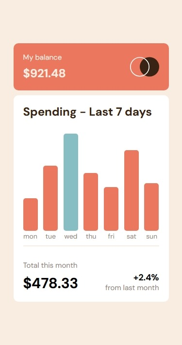
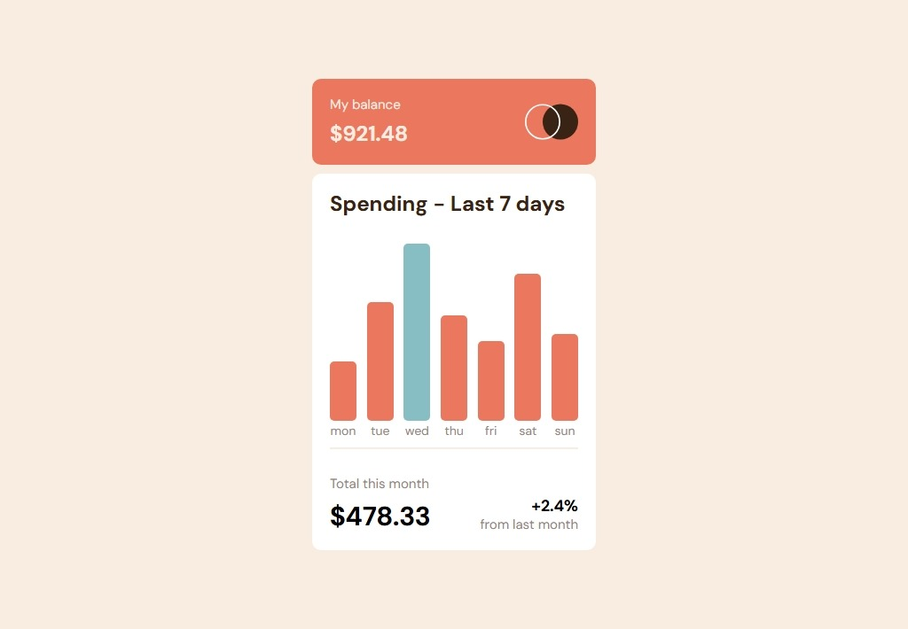
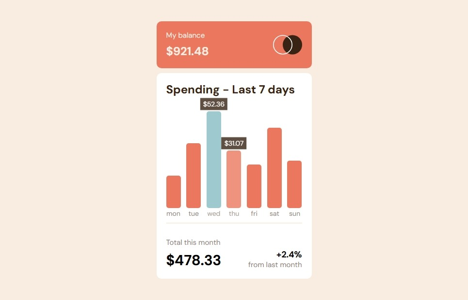

# expenses-chart-component-main

This is a solution to the [expenses-chart-component-main on Frontend Mentor](https://www.frontendmentor.io/challenges/expenses-chart-component-e7yJBUdjwt). Frontend Mentor challenges help you improve your coding skills by building realistic projects. 

## Table of contents

- [Overview](#overview)
  - [Screenshot](#screenshot)
  - [Links](#links)
- [My process](#my-process)
  - [Built with](#built-with)
  - [What I learned](#what-i-learned)
  - [Continued development](#continued-development)
- [Author](#author)

## Overview

### Screenshot

These are my screenshots showing how the project turned out.

- Mobile design:



- Desktop design:



- Active state:



### Links

- Solution URL: [My Solution](https://github.com/gillaercio/expenses-chart-component-main)

## My process

### Built with

- Semantic HTML5 markup
- CSS custom properties
- Flexbox
- CSS Grid
- Mobile-first workflow
- JavaScript
- JSON

### What I learned

I took advantage of this project to practice using **BEM** with HTML, **Pseudo-elements** and **Reset CSS** with **CSS** and **Events** with **JavaScript**:

BEM (Block Element Modifier)

```html
  <div class="balance__info">
    <h2 class="balance__title">My balance</h2>
    <p class="balance__amount">$921.48</p>
  </div>
```

Pseudo-element

```css
*,
*::before,
*::after {
  margin: 0;
  padding: 0;
  box-sizing: border-box;
}
```

Events

```js
document.addEventListener('DOMContentLoaded', async () => {
  const response = await fetch('./data.json');
  const data = await response.json();

  const maxAmount = Math.max(...data.map(item => item.amount));
  const bars = document.querySelectorAll('.chart__bar');

  bars.forEach(bar => {
    const day = bar.dataset.day;
    const record = data.find(item => item.day === day);

    if (record) {
      const height = (record.amount / maxAmount) * 100;
      bar.style.height = `${height}%`;
      bar.title = `$${record.amount}`;

      const value = document.createElement('span');
      value.classList.add('bar__value');
      value.textContent = `$${record.amount}`;

      const label = document.createElement('span');
      label.classList.add('bar__label');
      label.textContent = record.day;

      bar.appendChild(value);
      bar.appendChild(label);
    }

    if (record.amount === maxAmount) {
      bar.style.backgroundColor = 'var(--Blue-300)';
    } else {
      bar.style.backgroundColor = 'var(--Red-500)';
    }
  });
});
```

### Continued development

I would like to improve the use of the **HTML**, **CSS** and **JavaScript**.

## Author

- Frontend Mentor - [@gillaercio](https://www.frontendmentor.io/profile/gillaercio)
- Github - [My Github](https://github.com/gillaercio)
- LinkedIn - [My LinkedIn](https://www.linkedin.com/in/gildman-la%C3%A9rcio/)